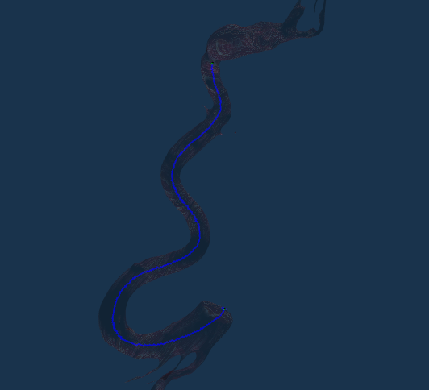
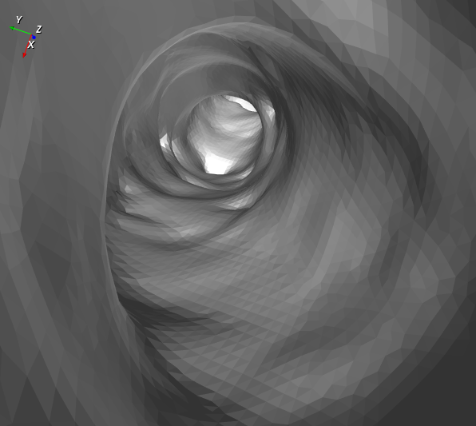
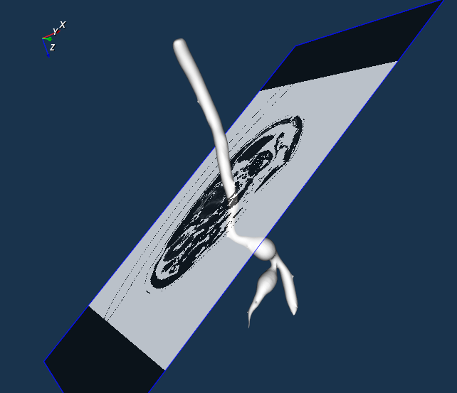

# Virtual-Endoscopy
a computer aided surgery system

## develop tools
[vtk](http://www.vtk.org/), [itk](http://www.itk.org/) and [Qt](http://www.qt.io/).
### Some runtime scene:

centerline (determine path for virtual roaming and tumor diometer measurement):

Virtual Roaming scene:

virtual Sclice (interactively get 2D plane at any angle):

